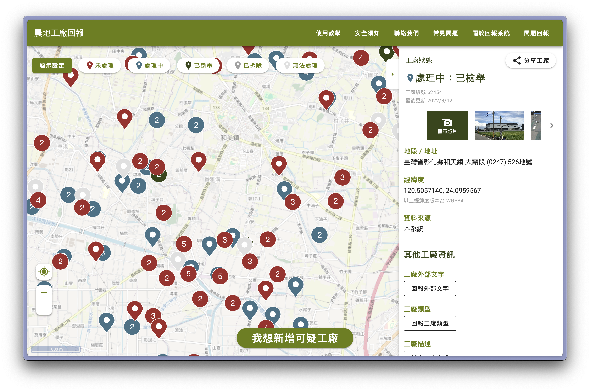

# Disfactory frontend



This is the frontend of [Disfactory](https://disfactory.tw), a platform for reporting illegal factories in Taiwan.

For the backend, please refer to [Disfactory](https://github.com/Disfactory/Disfactory) repository.

## Getting Started

### Prerequisites

Before you begin, ensure you have the following installed on your system:

- **Node.js**: Version 16 or higher (we use Node.js 16 as specified in `.nvmrc`)
  - You can download it from [nodejs.org](https://nodejs.org/)
  - Or use a version manager like [nvm](https://github.com/nvm-sh/nvm)
- **npm**: Comes with Node.js (version 7+ recommended)
- **Git**: For version control

### Quick Start

1. **Clone the repository**
   ```bash
   git clone https://github.com/Disfactory/frontend.git
   cd frontend
   ```

2. **Install dependencies**
   ```bash
   npm install
   ```

3. **Set up environment variables**
   ```bash
   cp .env.example .env
   ```
   
   The `.env` file contains configuration for the API endpoints. The default values should work for development.

4. **Start the development server**
   ```bash
   npm run serve
   ```
   
   The application will be available at `http://localhost:8080`

### Available Scripts

| Command | Description |
|---------|-------------|
| `npm run serve` | Starts the development server with hot-reload |
| `npm run build` | Builds the app for production |
| `npm run test` | Runs the unit tests |
| `npm run test:watch` | Runs tests in watch mode |
| `npm run lint` | Lints and fixes files |
| `npm run typecheck` | Type-checks the code without emitting files |

### Project Structure

```
src/
├── components/     # Vue components
├── lib/           # Utilities and libraries
├── api/           # API related functions
├── types.ts       # TypeScript type definitions
└── main.ts        # Application entry point
docs/              # Documentation
public/            # Static assets
```

### Development Environment

- **Framework**: Vue.js 2.7 with Composition API
- **UI Library**: Vuetify 2.x
- **Map Library**: OpenLayers
- **Language**: TypeScript
- **Testing**: Jest with Vue Testing Library
- **Linting**: ESLint with TypeScript support

### Troubleshooting

**Node.js version issues**
```bash
# If you're using nvm, switch to the correct version
nvm use 16
```

**Port already in use**
```bash
# Kill processes using port 8080
lsof -ti:8080 | xargs kill -9
# Or specify a different port
npm run serve -- --port 3000
```

**Build or dependency issues**
```bash
# Clear npm cache
npm cache clean --force
# Remove node_modules and reinstall
rm -rf node_modules package-lock.json
npm install
```

### Contributing

1. Fork the repository
2. Create your feature branch (`git checkout -b feature/amazing-feature`)
3. Make your changes following the coding standards
4. Run tests and linting (`npm run test && npm run lint`)
5. Commit your changes (`git commit -m 'Add some amazing feature'`)
6. Push to the branch (`git push origin feature/amazing-feature`)
7. Open a Pull Request

For more detailed development information, check out [docs/development.md](./docs/development.md).

## High Level Design

Check out the [Design](./docs/design.md) document for more information.

## Development

Check out development guide in [docs/development.md](./docs/development.md).

## Links

- Production server: [https://disfactory.tw](https://disfactory.tw) (auto-deployed from `production` branch)
- Staging Server: [https://dev.disfactory.tw](https://dev.disfactory.tw) (auto-deployed from `master` branch)
- [Disfactory_UI_design - Figma](https://www.figma.com/file/nTYqE10obqYSy2x9zY6Oer/Disfactory_UI_design?node-id=244%3A648)

## License

This project is licensed under the MIT License - see the [LICENSE](./LICENSE) file for details.
